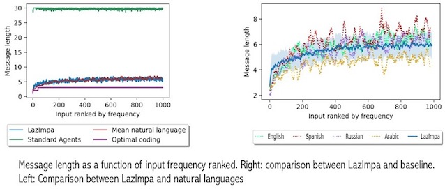
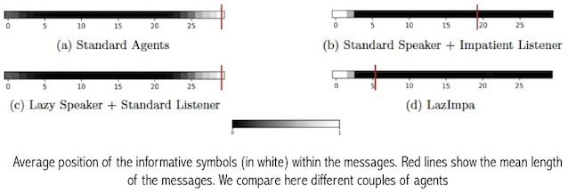

# LazImpa

This repository gathers the code used for all the experiments of the following paper:

- *“LazImpa”: Lazy and Impatient neural agents learn to communicate efficiently* (under review)

The code is an extension of EGG toolkit (https://github.com/facebookresearch/EGG) presented in *EGG: a toolkit for research on Emergence of lanGuage in Games*, Eugene Kharitonov, Rahma Chaabouni, Diane Bouchacourt, Marco Baroni. EMNLP 2019.

## 📋 Presentation

#### The game


`LazImpa` repository implements a Speaker/Listener game where agents have to cooperatly communicate in order to win the game. The Speaker receives an input (one-hot vector) it has to communicate to the Listener. To do so, it sends a message to the Listener. The Listener consumes the message and output a candidate. The agents are then succesful if the Listener correctly reconstructes the ground-truth input.

#### Aim of the paper

Previous experiments showed that Standard agents surprisingly develop non efficient codes. In particular, the language that emerges does not bear core properties of natural languages such as compositionality or length efficiency. In the paper, we study the latter property, Zipf's Law of Abbreviation (ZLA) that states that the most frequent messages are shorter than less frequent ones. We study the influence of humanly plausible constraints on length statistics. We particularly introduce a new communication system *LazImpa* composed of a Lazy Speaker and an Impatient Listener. The first is made increasingly lazy (least effort) while the second tries to guess the intended content as soon as possible. We show that near-optimal codes can emerge from this communication system.

#### Main paper results

- **LazImpa** allows the emergence of an efficient code that follows Zipf's Law of Abbrevation. On the contrary, the code that emerges from Standard Agents is not efficient and almost all message length are equal to the maximum length set by the user.

- With the settings of the paper, we show that agents are able to reach the performances of natural languages even though they do not manage to converge toward Optimal Coding (we explore causes of sub-optimality in the paper).

Length statistics are shown in the following figure:



- We analyze the effects of the modelling choices and especially **the position of information** within the messages (see the definition of informative symbols in the paper). We show that Standard Agents (LSTMs) tend to place informative symbols at the end of the messages. On the contrary, the introduction of Impatient Listener causes a shift of information at the beginning of the messages. While regularization (Lazy Speaker) is impossible with a Standard Listener, it well shortens message lengths with Impatient Listener. We suggest that the location of information within the message is crucial for length regularization.

The average position of informative symbols are shown in the following figure (red lines mark the average message length). We test different couples of agents:



## 💻 Run the code

We show here an example of experiment that can be run on Google Colab (smaller input space than in the paper). We also provide a notebook (**LINK**) that can directly be run in Colab to quickly reproduce our results on a smaller input space. The command line that should be run to reproduce our paper results (larger input space) are reported below in the section [Reproductibility](http://github.com/MathieuRita/LE_test#Reproductibility).

#### Command lines

1. First clone the repository:
```
git clone https://github.com/MathieuRita/LE_test.git
mv "./LE_test/egg" "./egg"
```

2. Create a directory in which all the useful data will be saved (you have to respect the following hierarchy):

```
mkdir dir_save
mkdir dir_save/sender
mkdir dir_save/receiver
mkdir dir_save/messages
mkdir dir_save/accuracy
```


3. Train agents:

```
python -m egg.zoo.channel.train   --dir_save=dir_save \
                                  --vocab_size=40 \
                                  --max_len=30 \
                                  --impatient=True \
                                  --reg=True \
                                  --n_features=100 \
                                  --print_message=False \
                                  --random_seed=7 \
                                  --probs="powerlaw" \
                                  --n_epoch=401 \
                                  --batch_size=512 \
                                  --length_cost=0. \
                                  --sender_cell="lstm" \
                                  --receiver_cell="lstm" \
                                  --sender_hidden=250 \
                                  --receiver_hidden=600 \
                                  --receiver_embedding=100 \
                                  --sender_embedding=10 \
                                  --batches_per_epoch=100 \
                                  --lr=0.001 \
                                  --sender_entropy_coeff=2. \
                                  --sender_num_layers=1 \
                                  --receiver_num_layers=1 \
                                  --early_stopping_thr=0.99
```

4. Test agents:

Once agents are trained, you can reuse the agents weights saved in `dir_save/sender` and `dir_save/receiver` to test the agents:

```
python -m egg.zoo.channel.test --impatient=True \
                               --save_dir="analysis/" \ #*TO DO necessary ??*
                               --receiver_weights="/dir_sav/receiver/receiver_weights400.pth" \
                               --sender_weights="/dir_save/sender/sender_weights400.pth" \
                               --vocab_size=40 \
                               --max_len=30 \
                               --n_features=100 \
                               --sender_cell="lstm" \
                               --receiver_cell="lstm" \
                               --sender_hidden=250 \
                               --receiver_hidden=600 \
                               --receiver_embedding=100 \
                               --sender_embedding=10 \
                               --sender_num_layers=1 \
                               --receiver_num_layers=1
```

**TO DO**

5. Evaluate the position of informative symbols within the messages

The definition of informative symbols and protocol to find them is defined in the paper. To reproduce the test, please run:

```
python ???
```

**TO DO**

####  H-parameters description

H-params can be divided in 3 classes: experiment settings, architecture H-params, optimization H-params, backup H-params. Here is a description of the main H-parameters:

1. Experimental settings:
- `vocab_size`: size of vocabulary in the communication channel (default=40)
- `max_len`: maximum length of the message in the communication channel (default=30)
- `n_features`: dimensionality of the concept space (number of inputs)
- `probs`: frequency distribution of the inputs (default=`powerlaw`)

2. Architecture H-params:
- `impatient`: if set to `True`, the Receiver is made Impatient
- `reg`: if set to `True`, the Sender is made Lazy
- `sender_cell`: type of Sender recurrent cell (in the whole paper: `lstm`)
- `sender_hidden`: Size of the hidden layer of Sender
- `sender_embedding`: Dimensionality of the embedding hidden layer for Sender
- `sender_num_layers`: Number hidden layers of Sender
- `receiver_cell`: type of Sender recurrent cell (in the whole paper: `lstm`)
- `receiver_hidden`: Size of the hidden layer of Receiver
- `receiver_embedding`: Dimensionality of the embedding hidden layer for Receiver
- `receiver_num_layers`: Number hidden layers of Receiver

3. Optimization H-params:
- `n_epochs`: number of training episodes
- `batches_per_epoch`: number of batches per training episode
- `batch_size`: size of a batch
- `lr`: learning rate
- `sender_entropy_coeff`: The entropy regularisation coefficient for Sender (trade-off between exploration/exploitation)
- `length_cost`: penalty applied on message length (if `reg` is set to `True`, this penalty is schedulded as done in the paper)

### Insights

##### Training

Here are some insights to analyze the training. The first plot show the evolution of the length distribution of the messages (they are ranked by their frequency), the evolution of the accuracy and the evolution of the mean length:


(in blue: LazImpa emergent code ; in orange: Optimal coding (see details in the paper)).

##### Positional encoding

**TO DO**

## 🌍 Reproductibility

##### LazImpa

To reproduce the results obtained in the paper for LazImpa, just run the following command line. Please note that the running time is quite long (in the paper we average our results on different seeds, feel free to test different values).

```
python -m egg.zoo.channel.train   --dir_save=dir_save --vocab_size=40 --max_len=30 --impatient=True --reg=True --n_features=1000 --print_message=False --random_seed=1 --probs="powerlaw" --n_epoch=2501 --batch_size=512 --length_cost=0. --sender_cell="lstm" --receiver_cell="lstm" --sender_hidden=250 --receiver_hidden=600 --receiver_embedding=100 --sender_embedding=10 --batches_per_epoch=100 --lr=0.001 --sender_entropy_coeff=2. --sender_num_layers=1 --receiver_num_layers=1 --early_stopping_thr=0.99
```

##### Emergent language baselines

If you also want to reproduce the baselines shown in the paper, you just have to play with the Hparams `impatient` and `reg` (the other Hparams can be unchainged):

- *LazImpa* : `impatient=True`, `reg=True`
- *Standard agents*: `impatient=False`, `reg=False`
- *Standard Listener + Lazy Speaker*: `impatient=False`, `reg=True`
- *Impatient Listener + Standard Speaker*: `impatient=True`, `reg=True`

##### Natural Languages

To reproduce the natural language curves, please find the corpus here: [Natural languages corpus](http://corpus.leeds.ac.uk/serge/).

##### Optimal coding

Optimal coding is a theoretical optimal distribution. It is merely constructed by associating the shortest messages to the most frequent inputs (under the constraint that all the messages are different given a vocabulary size), so that Optimal Coding minimizes the sum of message lengths averaged by their frequency.

## ✒️ How to cite ?

The paper is currently under review.
